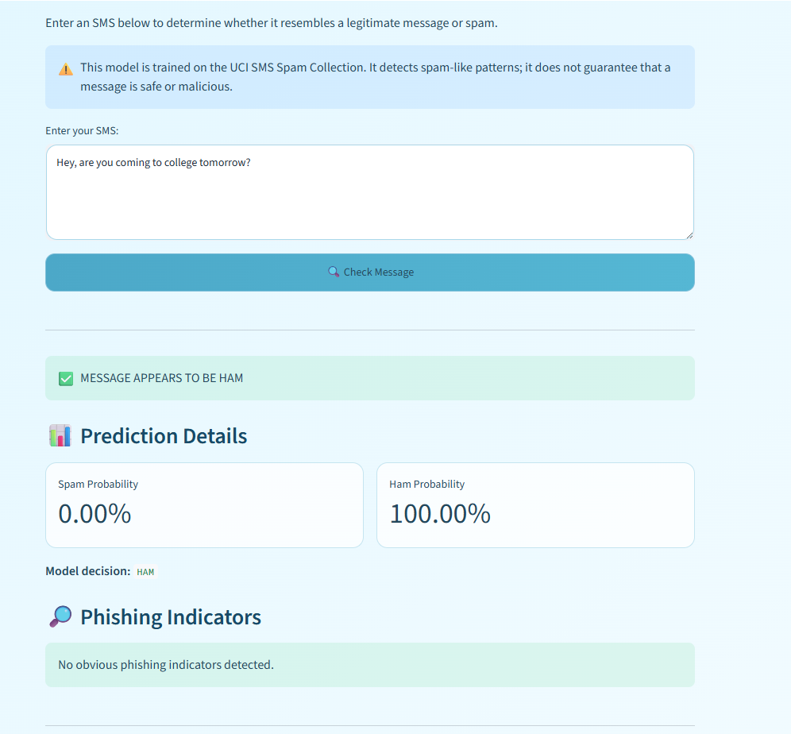
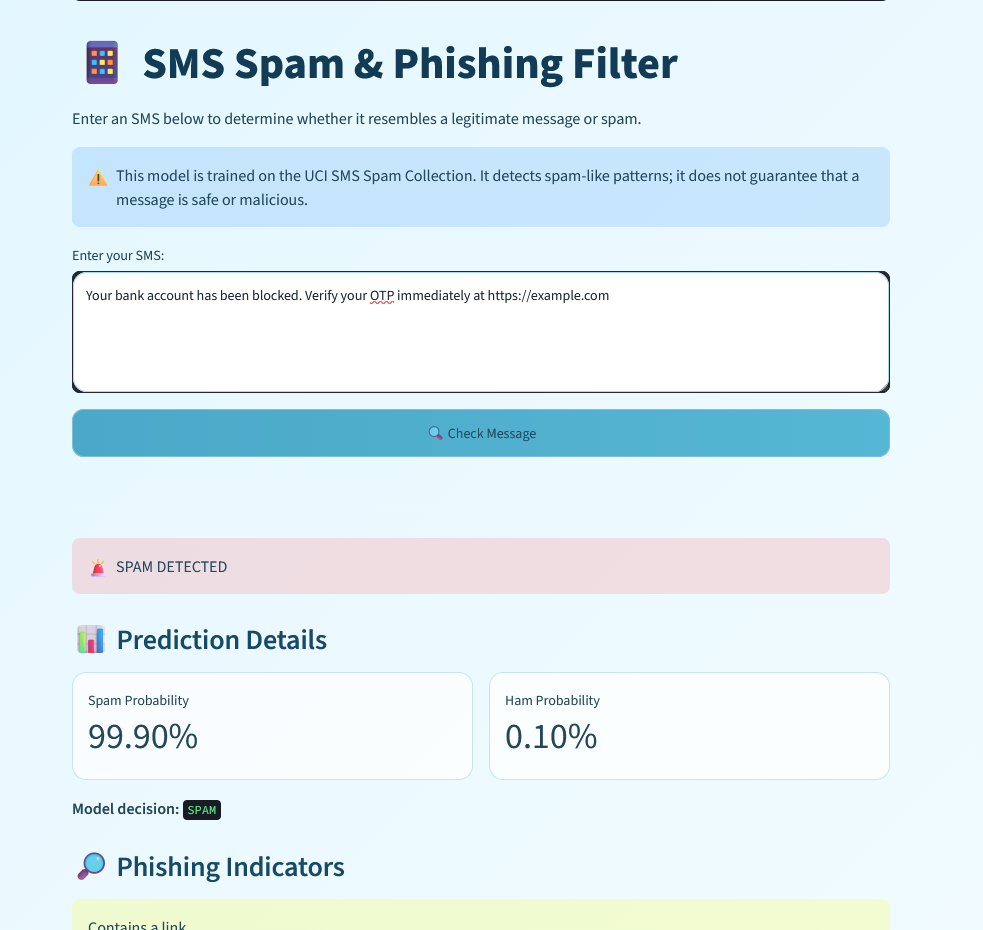
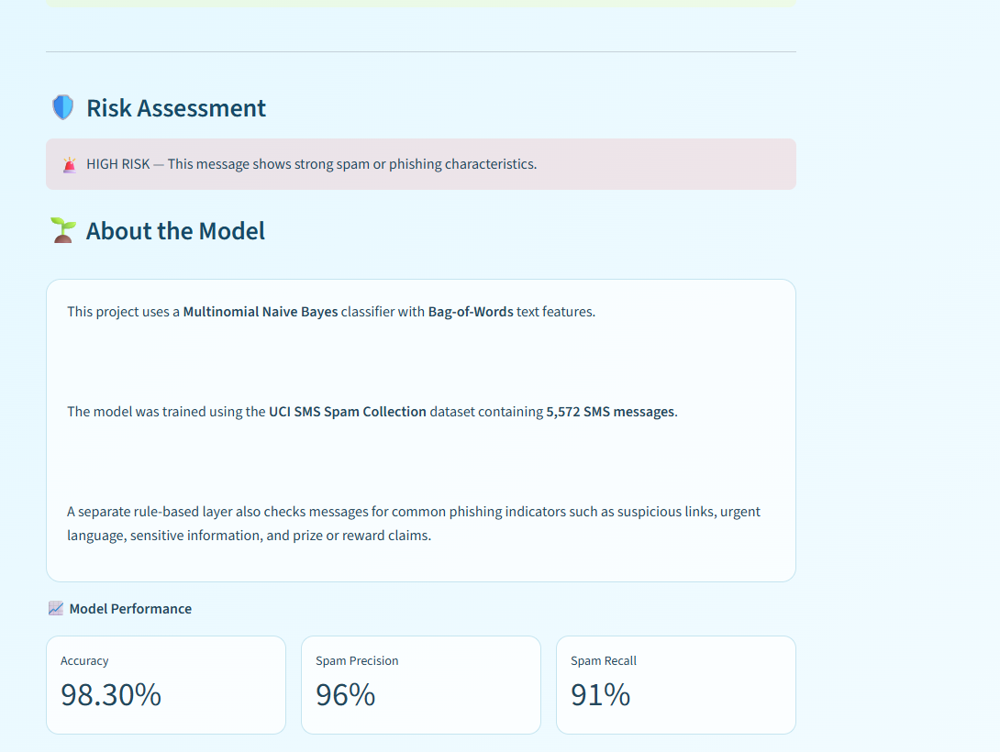

# 📱 SMS Spam & Phishing Filter

An end-to-end machine learning application that classifies SMS messages as **Spam** or **Ham (Legitimate)** and identifies common phishing indicators.

## 🚀 Live Demo

[Try the SMS Spam & Phishing Filter](https://sms-spam-phishing-filter-bvw8vbj9snec7guemlaxh5.streamlit.app/)

## 🖥️ Application Screenshots

### 🟢 HAM Detection

The application correctly identifies a normal SMS as legitimate.



### 🔴 Spam & Phishing Detection

The application detects a suspicious message and identifies phishing indicators such as a link, urgent language, and sensitive banking information.



### 📊 Risk Assessment & Model Performance

The application provides a risk assessment along with the model's evaluation metrics.


## 📌 Project Overview

Spam and phishing messages are commonly used to trick users into revealing sensitive information or interacting with malicious links.

This project combines:

- Machine Learning for SMS spam classification
- Natural Language Processing (NLP)
- Rule-based phishing indicator detection
- An interactive Streamlit web application

The system provides both a classification result and an estimated probability for the spam/ham decision.

> **Note:** The machine learning model is trained for spam/ham classification. The phishing analysis is a separate rule-based layer that identifies common suspicious characteristics.

## 🧠 Machine Learning Pipeline

```text
SMS Dataset
     ↓
Text Preprocessing
     ↓
Train/Test Split
     ↓
Bag-of-Words Feature Extraction
     ↓
Multinomial Naive Bayes
     ↓
Prediction & Probability
     ↓
Phishing Indicator Analysis
     ↓
Risk Assessment
     ↓
Streamlit Web Application